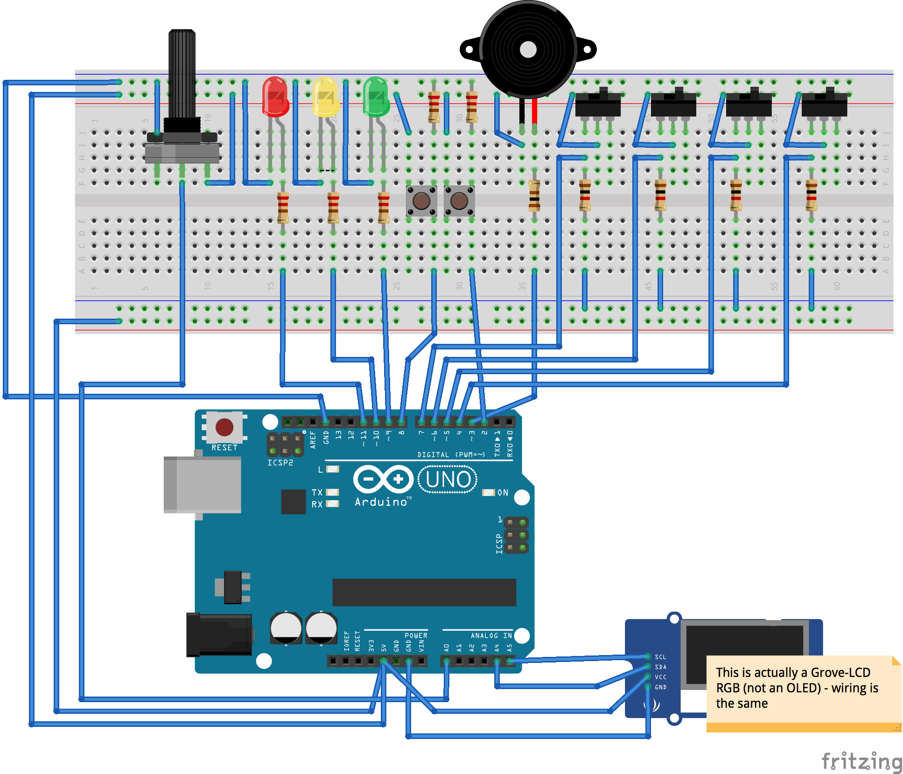

# Ground Control

A programmable control panel device, complete with buttons, toggles, lights and a display.

The Ground Control device brings that satisfying physical feedback of pushing buttons on a lunar lander to your boring day-to-day tasks.

You can use it as a control device for anything, either using the Go APIs or via the provided command-line client. 

Use-cases include anything from controlling your HUE lights, displaying a tweet, ordering Soylent on Amazon or even deploying software!


## Code usage

See [control_test.go](control_test.go) for examples


## Command Line usage

###  Connect to the device:

`ground_control -port /dev/tty.usbmodem1411 &`

In order to communicate to the device


### Get the current state of all controls
```
> ground_control -read
```
```json
{
  "outputs": {
    "0x01": {
      "type": "RGBA",
        "color": "RED",
        "state": "ON"
      },
      "0x02": {
        "type": "LED",
        "state": "OFF"
      },
      "0x03": {
        "type": "LCD",
        "state": "ON",
        "text": "Hello World"
      }
  },
  "inputs": {
    "0x04": {
      "type": "SWITCH",
      "state": "ON"
    },
      "0x05": {
      "type": "BUTTON"
    }
  }
}
```

### Change a piece of state
```
> ground_control -set 0x01 color=GREEN
```

### Listen for state changes
```
> ground_control -listen
```


## Arduino Setup

- Install [Firmata](http://gort.io/documentation/cli/arduino/) on the Duino:

```
> gort arduino upload firmata /dev/tty.usbmodem1411 -b uno
```

## Device Wiring




## References 
https://gobot.io/documentation/platforms/arduino/


# TODO

- api
- arduino code